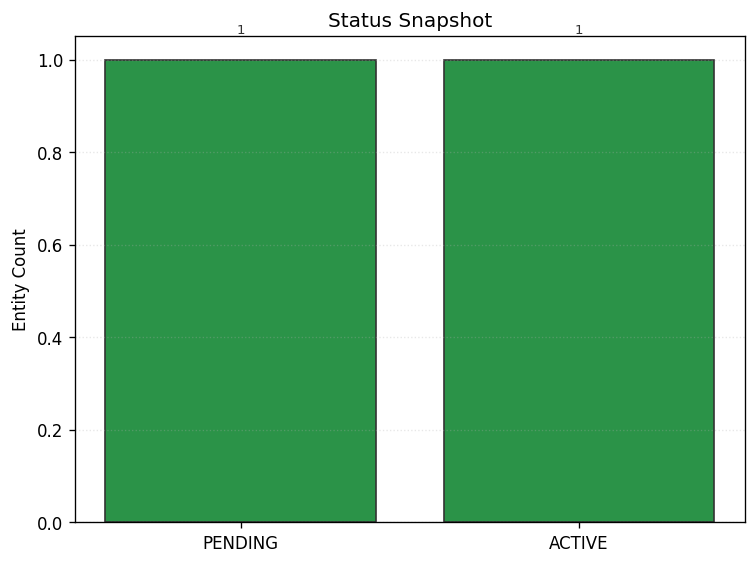

# Project Chronos

A comprehensive system for tracking and visualizing corporate entities across their lifecycle, with multi-source data integration from all 50 states.



## Overview

Project Chronos is designed to track and analyze corporate entity data with:

- Lifecycle status management
- Entity ownership and relationship visualization 
- Advanced shell company detection
- Multi-source data integration with Cobalt Intelligence and SEC EDGAR
- Interactive visualization dashboard

## Features

- **Corporate Entity Tracking**: Monitor entities across their complete lifecycle 
- **Relationship Mapping**: Visualize parent-subsidiary relationships and ownership chains
- **Shell Company Detection**: Advanced analytics to identify potential shell company structures
- **Multi-Source Data**: Integration with Cobalt Intelligence API for comprehensive 50-state coverage
- **Interactive Dashboard**: React-based UI with relationship graph visualization

## Project Structure

### Core Backend

- **`chronos/models.py`**: Core data models including `CorporateEntity` and `Status` enum
- **`chronos/portfolio.py`**: In-memory entity portfolio management
- **`chronos/portfolio_db.py`**: SQLite-backed persistent storage
- **`chronos/relationships.py`**: Entity connection modeling
- **`chronos/lifecycle.py`**: Status transition management

### API Endpoints

- **`api/main.py`**: Main FastAPI application
- **`api/cobalt.py`**: Cobalt Intelligence API integration
- **`api/edgar.py`**: SEC EDGAR integration endpoints

### Frontend

- **`EntityTable.tsx`**: Interactive entity listing
- **`StatusChart.tsx`**: Status visualization
- **`RelationshipGraph.tsx`**: Force-directed graph visualization
- **`ShellDetection.tsx`**: Shell company risk analysis

## Shell Company Detection

The system includes a multi-factor shell company detection algorithm that identifies potential shell entities based on entity attributes and known risk patterns.

### Algorithm Overview

The shell detection algorithm assigns risk scores based on these factors:

1. **Entity Structure and Type** (40% of risk score)
   - LLC structure with limited visibility (+30% risk)
   - Holding company naming patterns (+15% risk)
   - Delinquent filing status (+20% risk)
   - Missing formation date or recent formation (+10% risk)

2. **Jurisdiction Analysis** (30% of risk score)
   - Incorporation in known shell-friendly jurisdictions: 
     - Delaware (+15% risk)
     - Wyoming (+15% risk)
     - Nevada (+15% risk)
   - Delaware LLC with limited transparency requirements (+25% risk)

3. **Ownership Patterns** (30% of risk score)
   - Entities owned but with no subsidiaries
   - Chains of single-child ownership
   - Shared officers across multiple entities

### Example Shell Company Structure

```
Central Holdings (WY)
├── Global Services Inc (100%)
└── Pacific Group (51%)

Acme Corporation (DE)
├── TechStart LLC (100%)
└── Widget Industries (75%)
```

In this example, TechStart LLC would receive a high risk score (65%) due to:
- LLC structure with limited visibility (+30%)
- Owned but has no subsidiaries (+30%)
- Delaware jurisdiction (+5%)

## Data Sources

The system integrates with two primary data sources:

### 1. Cobalt Intelligence API
- Comprehensive data for all 50 US states
- Company details, officers, filings, UCC data

### 2. SEC EDGAR Integration
- SEC filing information and CIK numbers

## Relationship Visualization

The system implements a force-directed graph visualization for entity relationships:

- Color-coded nodes based on entity status:
  - PENDING: `#fde047` (yellow)
  - ACTIVE: `#4f46e5` (indigo)
  - IN_COMPLIANCE: `#10b981` (green)
  - DELINQUENT: `#ef4444` (red)
  - DISSOLVED: `#64748b` (slate)

- Directed edges showing parent-subsidiary relationships with ownership percentages
- Interactive node selection and zooming
- Filtering capabilities for complex relationship networks

## Data Structures

Project Chronos utilizes multiple specialized data structures to efficiently manage, store, and visualize corporate entity data:

### Core Data Structures

1. **Graph (NetworkX DiGraph)**
   - **Location**: `chronos/relationships.py`
   - **Usage**: Models parent-subsidiary relationships between corporate entities
   - **Why**: Provides efficient traversal of corporate hierarchies, ownership chains, and visualization of relationships
   - **Implementation**: Uses NetworkX's directed graph (DiGraph) with nodes for entities and edges for ownership relationships

2. **Dictionary-Based Registry**
   - **Location**: `chronos/portfolio.py`
   - **Usage**: In-memory storage for quick entity lookup and retrieval
   - **Why**: O(1) lookup time by entity slug, efficient for frequent queries
   - **Implementation**: Python dictionary with slugified entity names as keys and `CorporateEntity` objects as values

3. **SQLite-Backed Persistent Store**
   - **Location**: `chronos/portfolio_db.py` and `chronos/db.py`
   - **Usage**: Database persistence layer for long-term entity storage
   - **Why**: Preserves data between application restarts, allows for querying by various attributes
   - **Implementation**: SQLModel ORM mapping `CorporateEntity` objects to database rows

4. **Enum-Based State Machine**
   - **Location**: `chronos/models.py` (Status enum) and `chronos/lifecycle.py`
   - **Usage**: Tracks and manages entity lifecycle states
   - **Why**: Provides type safety and clear state transitions for entity lifecycle management
   - **Implementation**: Python Enum with status values (PENDING, ACTIVE, etc.) and state transition guards

5. **Dataclass Models**
   - **Location**: `chronos/models.py`
   - **Usage**: Structured representation of business entities and their attributes
   - **Why**: Type-safe, self-documenting code with automatic validation
   - **Implementation**: Python dataclasses for `CorporateEntity` with appropriate type hints

### Specialized Algorithms

1. **Shell Company Detection Algorithm**
   - **Location**: `chronos/relationships.py` and `api/main.py`
   - **Usage**: Multi-factor risk scoring for potential shell companies
   - **Why**: Identifies suspicious patterns in corporate structures
   - **Implementation**: Weighted scoring algorithm using graph analysis and entity attributes

2. **Force-Directed Graph Layout**
   - **Location**: `chronos-dashboard/src/components/RelationshipGraph.tsx`
   - **Usage**: Visual representation of corporate relationships
   - **Why**: Intuitive visualization of complex corporate structures
   - **Implementation**: D3.js force simulation with custom node and link rendering

## Implementation Details

- Backend: Python with FastAPI
- Frontend: React with Tailwind CSS
- Data visualization: D3.js with react-force-graph
- Database: SQLite for persistence
- API integrations: Cobalt Intelligence, SEC EDGAR

## License

This project is licensed under the terms included in the LICENSE file.